# gbserver Architecture Diagram

```mermaid
flowchart TB
    subgraph Orchestration["Orchestration Layer"]
        BW["BuildWatcher\npoll loop, thread mgmt"]
        ABR["AbstractBuildRunner\n«interface»"]
        BRJ["BuildRunnerJob\nK8s Job dispatch"]
        BRP["BuildRunnerProcess\nsubprocess dispatch"]
        BR["BuildRunner\nin-process exec"]
        BW -->|"creates & threads"| ABR
        ABR --> BRJ
        ABR --> BRP
        ABR --> BR
    end

    subgraph Definitions["Build Definition Hierarchy"]
        B["Build\ntargets, config, space"]
        T["Target\nenvironment, steps"]
        TS["TargetStep\nlauncher, monitors, full_config"]
        S["Step\nstepasset, config, step_yaml"]
        B -->|"1..* targets"| T
        T -->|"1..* targetsteps"| TS
        TS -->|"references"| S
    end

    subgraph Runtime["Runtime Execution Hierarchy"]
        BRUN["BuildRun\nstarting_targets, binding_mapping"]
        TR["TargetRun\nbindings, target_step_runs"]
        TSR["TargetStepRun\nlaunch_id, full_config"]
        BRUN -->|"creates & orchestrates"| TR
        TR -->|"creates & sequences"| TSR
    end

    subgraph Environments["Environment Layer"]
        ENV["Environment\n«abstract»\nlaunch / monitor / cleanup\nloadasset / pushasset"]
        K8S["K8s\nJob pods, kubectl"]
        LSF["LSF\nbsub, SSH tunnel"]
        DOCKER["Docker"]
        BASH["Bash"]
        RUNPOD["RunPod"]
        SKYPILOT["SkyPilot"]
        ENV --> K8S
        ENV --> LSF
        ENV --> DOCKER
        ENV --> BASH
        ENV --> RUNPOD
        ENV --> SKYPILOT
    end

    subgraph Assets["Asset / Store Layer"]
        ASSET["Asset\nuri, sync()"]
        ASB["Assetstore\n«abstract»\nload / push / metadata"]
        FS["FileStore\nfile://"]
        GS["GitStore\ngit://"]
        COS["CosStore\ncos://"]
        HFS["HfStore\nhf://"]
        LHS["LhStore\nlh://"]
        ENVS["EnvStore\nenv://"]
        ASSET -->|"resolves via"| ASB
        ASB --> FS
        ASB --> GS
        ASB --> COS
        ASB --> HFS
        ASB --> LHS
        ASB --> ENVS
    end

    subgraph EventBus["Event Bus"]
        EQ["event_q\nasyncio.Queue"]
        BE["BuildEvent\ntype, payload, metadata"]
        EQ -->|"streams"| BE
    end

    subgraph Storage["Persistent Storage"]
        SAS["SingletonAdminStorage"]
        SB["StoredBuild\nstatus, archive, retry chain"]
        STR["StoredTargetRun"]
        SSTR["StoredStepRun"]
        SQLB["SqlStorage\nPostgreSQL"]
        SQLITEB["SqliteStorage"]
        SAS --> SB
        SAS --> STR
        SAS --> SSTR
        SAS --> SQLB
        SAS --> SQLITEB
    end

    subgraph External["External Systems"]
        GH["GitHub Enterprise\nPR comments, status"]
        K8SAPI["Kubernetes API"]
        LSFAPI["LSF Cluster"]
        HFHUB["HuggingFace Hub"]
        IBMCOS["IBM COS"]
    end

    %% Cross-layer connections
    BW -->|"reads pending\nStoredBuilds"| SAS
    BR -->|"wraps"| B
    BR -->|"creates"| BRUN
    BR -->|"processes events\nupdates StoredBuild"| SAS
    BR -->|"posts status"| GH
    BRUN -->|"backed by"| B
    TR -->|"backed by"| T
    TSR -->|"backed by"| TS
    TSR -->|"launch/monitor/cleanup"| ENV
    TSR -->|"emits"| EQ
    ENV -->|"emits"| EQ
    ENV -->|"load/push assets"| ASB
    T -->|"has"| ENV
    K8S -->|"submits jobs"| K8SAPI
    LSF -->|"submits jobs"| LSFAPI
    HFS -->|"fetch/push models"| HFHUB
    COS -->|"read/write objects"| IBMCOS
    BRJ -->|"dispatches pod"| K8SAPI
    BR -->|"reads events from"| EQ

    classDef orchestration fill:#4a6fa5,color:#fff,stroke:#2d4a73
    classDef definition fill:#6b9e6b,color:#fff,stroke:#4a7a4a
    classDef runtime fill:#c17f2a,color:#fff,stroke:#8f5a1a
    classDef environment fill:#8b5a8b,color:#fff,stroke:#5a3a5a
    classDef asset fill:#5a8b8b,color:#fff,stroke:#3a6060
    classDef storage fill:#8b7a4a,color:#fff,stroke:#5a4a2a
    classDef event fill:#b05050,color:#fff,stroke:#7a3030
    classDef external fill:#555,color:#fff,stroke:#333

    class BW,ABR,BRJ,BRP,BR orchestration
    class B,T,TS,S definition
    class BRUN,TR,TSR runtime
    class ENV,K8S,LSF,DOCKER,BASH,RUNPOD,SKYPILOT environment
    class ASSET,ASB,FS,GS,COS,HFS,LHS,ENVS asset
    class SAS,SB,STR,SSTR,SQLB,SQLITEB storage
    class EQ,BE event
    class GH,K8SAPI,LSFAPI,HFHUB,IBMCOS external
```

## Key Interaction Flows

**1. Dispatch**
`BuildWatcher` polls `StoredBuild` from storage → creates a `BuildRunner` variant (in-process, K8s Job, or Process) → runner wraps `Build` and creates `BuildRun`.

**2. Execution cascade**
`BuildRun` resolves starting targets (no deps) → creates `TargetRun` per target → `TargetRun` sequences `TargetStepRun` per step → `TargetStepRun` calls `Environment.launch/monitor/cleanup`.

**3. Binding propagation**
When a step completes, `ARTIFACT_PUSHED` events carry output URIs → `BuildRun` marks the binding satisfied → dispatches any downstream `TargetRun` that was waiting on it.

**4. Asset flow**
`Environment.pullasset/pushasset` delegates to `Assetstore` (selected by URI prefix: `hf://`, `cos://`, `git://`, etc.) → actual I/O to external backend (HF Hub, IBM COS, git repo).

**5. Event bus**
Everything emits `BuildEvent` objects onto `event_q` → `BuildRunner` reads them to update `StoredBuild` status in DB and post GitHub PR comments.
